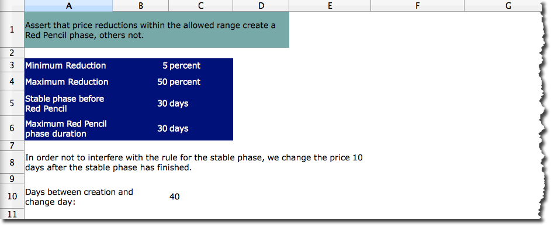
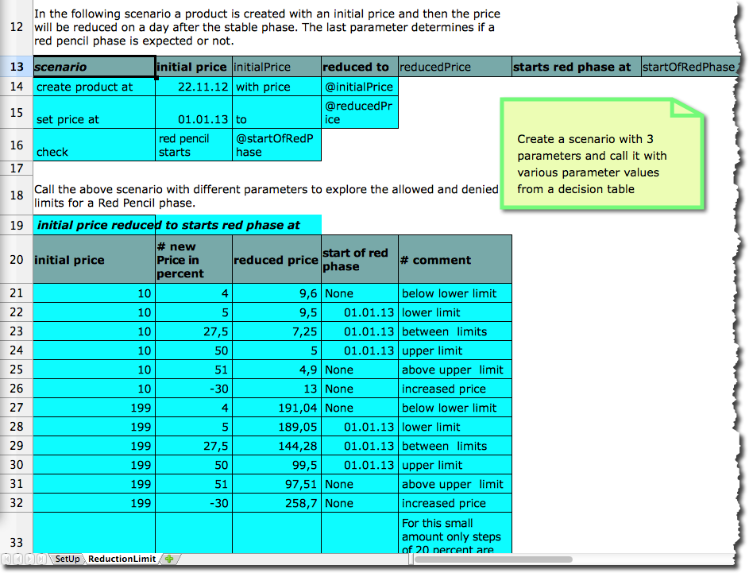
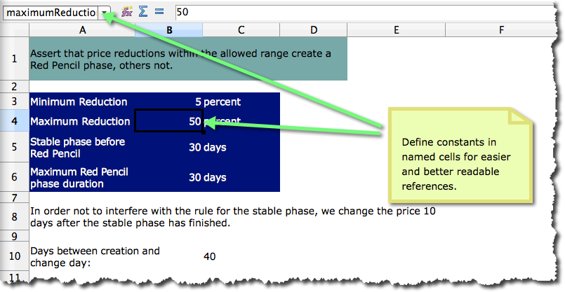
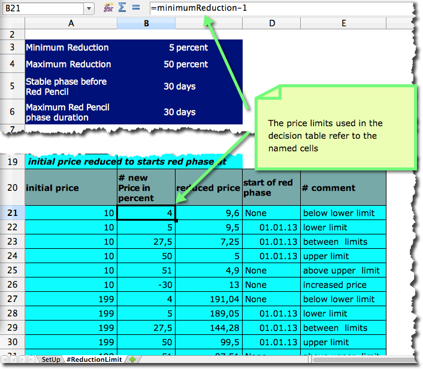
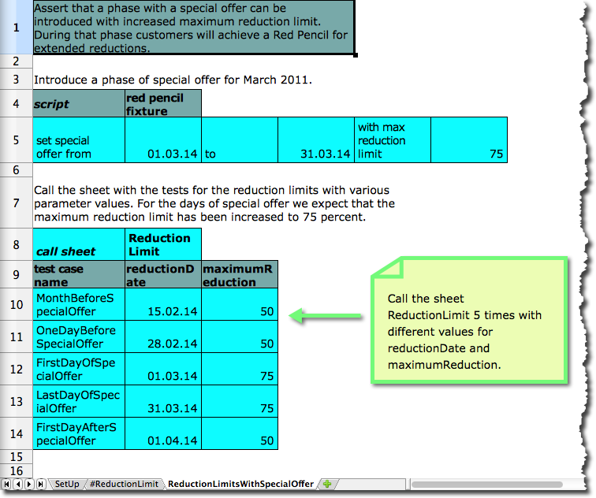
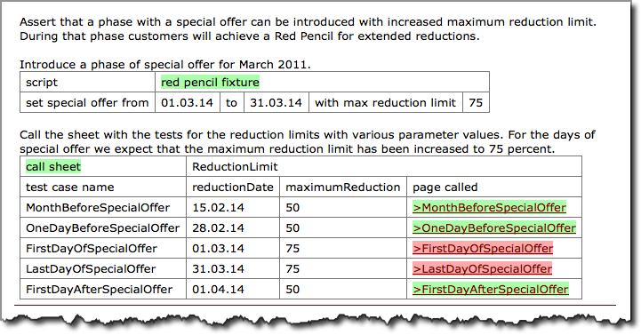
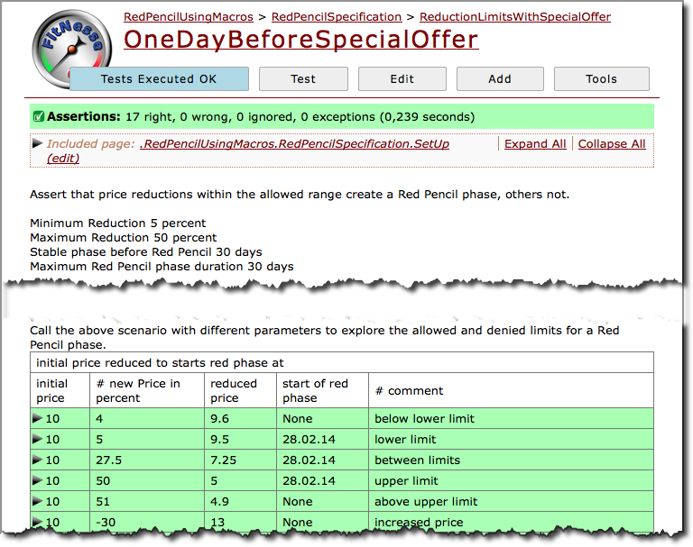
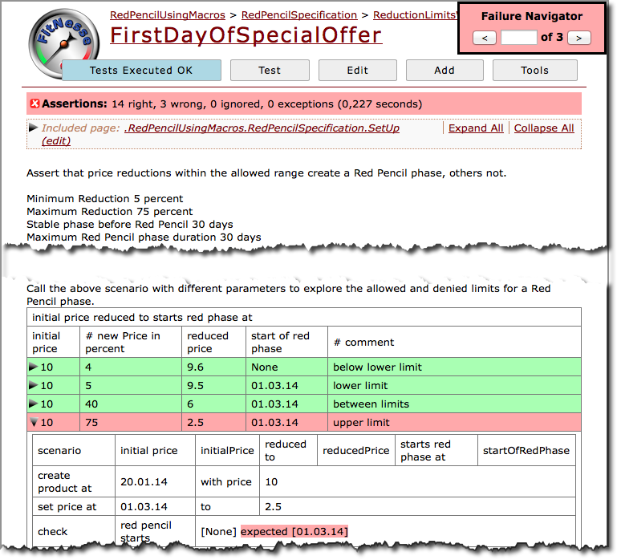

# Macro Sheets

## Introduction

Often there is need to run tests with the same structure but different values to cover edge cases. Therefore decision tables can be used. However, decision tables need glue code to execute. In an environment where test and development roles are separated, that can be a drawback. 

In addition the Slim table style  offers scenarios. With these the tester can define a certain course of actions based on already implemented building blocks. There is no additional glue code needed. The scenario can be parameterized and called from a decision table. This is good. However, the parameterization needs its own syntax and parameter values can only be used fixed. There are no calculations possible with these parameter values.

Within a spreadsheet, there are advanced possibilities. Parameterization is possible using the built-in spreadsheet functionality and parameters can be used like any other cell content in formulas. Here I want to describe the way how parameterisation of spreadsheets is currently implemented in this library.

In order to parameterize a sheet, follow these recipe:

1. Name the cells which should become parameters
2. Create a Sheet Call fixture in a new sheet 
3. Create one row in the fixture for every call, provide parameter values and name that test case

When spreadsheet-fitnesse finds a Sheet Call fixture, it 
* creates a sub page with the test case name, 
* replaces the parameters in the target sheet, 
* recalculates the formulas in the spreadsheet,
* and finally renders the content of the updated sheet into the wiki sub page

In the Sheet Call fixture itself it adds a link to the subpage.

When fitNesse runs the test the link is used to run the parameterized test and mark it as failed or passed.

## Example

To showcase the mechanism I would like to introduce an example which extends the [Red Pencil Kata](http://stefanroock.wordpress.com/2011/03/04/red-pencil-code-kata/). Let's assume that the product owner demands the following in addition to the existing rules of the Red Pencil kata:

*There should be special offer phases, where the upper limit for allowed price reductions can be increased*

###  Test for the original Kata

The following is a screenshot of the sheet named *ReductionLimit*, which specifies some of the requirements of the original Kata. It ensures that only price reductions in the allowed range defined by upper and lower limit will get a Red Pencil. 

### Parameterizing the Test

Now, lets parameterize the sheet in order to specifiy the new requirement. At first, make sure that constants are defined in named cells.

It is not really necessary that formulas refer to the name of the cell instead of the coordinates (e.g. $A$1). However, it makes the formulas far more readable.

Secondly, create a new sheet with one fixture for setting the special offer phase and a *Call Sheet* fixture, which calls the ReductionLimit sheet. There are five calls defined, three for testing the behaviour outside of the special offer phase and two for testing within. The names of the test cases (e.g. FirstDayOfSpecialOffer) will be used as names of the wiki pages which contain the parameterized test.

#### Test results

When the excel sheet is transformed to a wiki page, one page is created for the sheet with the macro page and one for every test case (i.e. row) of the call sheet fixture.

The following screenshot shows the test results.

One of the passing and the failing test for the first day of the special offer phase are following:

As expected the tests with the increased limits are failing. Now it is time to implement them.